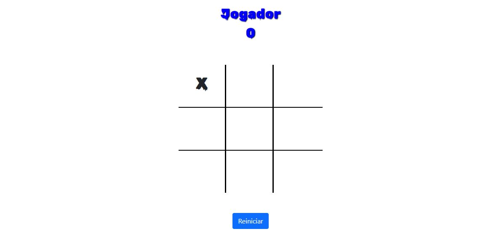
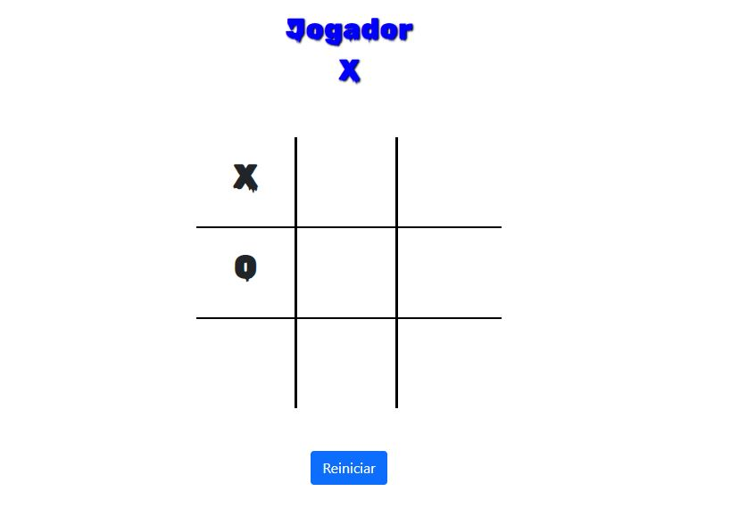
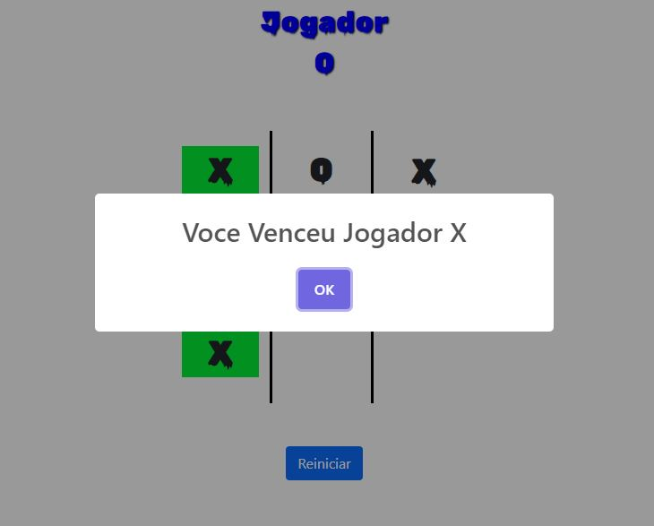
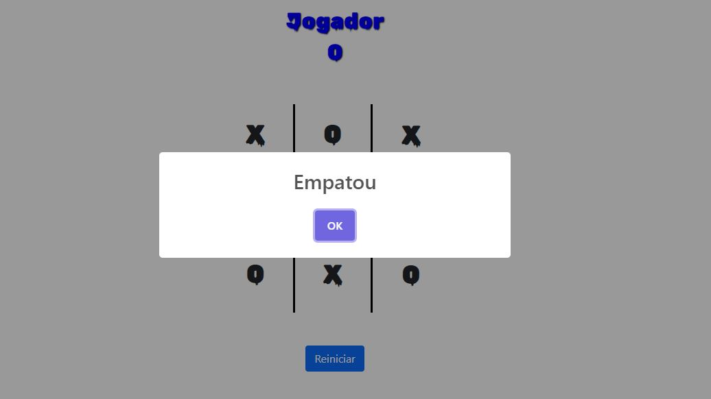

# JSj_jogodaVelha

#Jogo da velha 

Acesse para testar  <a href=" https://brunosvieira88.github.io/Jogo-da-Velha/" targert="blank">Clique Aqui</a>

Onde dois jogadores podem jogar um sendo " O " e o outro " X " 
como no jogo Classico um dos dois podem vencer fazendo uma sequencia na vertical, horizontal ou na diagonal 

jogo da velha onde o jogador   O  

joga contra o jogador X 

Caso haja vitoria 

Caso empate 

